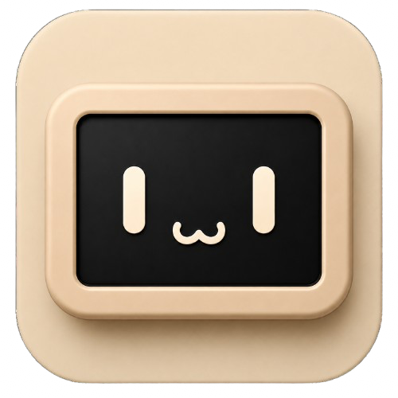

# AirMate

Your tablet, doing something useful.

AirMate turns an Android tablet into a real second display for your Mac — a
proper monitor macOS can see and arrange, not a mirror of a window.

Built for the Galaxy Tab A7 and anything like it.

## What it does

- **A real display** — the Mac creates an actual virtual monitor and only
  captures that one, so your own screen is never recorded and never sent.
- **Finds itself** — put both on the same Wi‑Fi and they pair on their own.
  There is a QR code on the Mac if you want to skip the search.
- **Gets out of the way** — the moment the picture arrives the interface parts
  down the middle and is taken off the device entirely. What is left is a
  decoder and a surface.
- **Comes back with a swipe** — pull in from either edge and the Mac's own
  controls open on that side: start and stop, resolution, HiDPI, how the tablet
  is allowed to rotate, and how hard to try before dropping a frame.
- **Turns the way you want** — auto-rotates within one axis at a time, so it
  never half-turns into the other shape while you are reading.

Hardware encode on the Mac, hardware decode on the tablet, and nothing in
between that waits: the picture on screen is always the newest one that arrived.

## Setting the Mac's controls from the tablet

The tablet can drive the Mac, but only once you say so. The first time it asks,
the Mac's window offers to allow it, and until someone presses that nothing the
tablet sends changes anything.

## Building

Everything is built by GitHub Actions — the macOS app and the Android APK, with
the APK bundled inside the `.app` so the Mac can hand it to you. Push and take
the artifacts from the run, or start the workflow by hand.

```
gh run download <run-id> -R RimorCosmicam/AirMate -n airmate-android-debug
```

On macOS, unzip the archive, move `AirMate.app` into Applications, then
Control-click it and choose **Open** the first time. Approve Screen Recording
when macOS asks, and restart AirMate so the grant takes effect. The build is
ad-hoc signed, not notarized.

## Before you use it

> [!WARNING]
> `CGVirtualDisplay` is a private CoreGraphics API. It is isolated in
> `mac/Sources/AirMatePrivateCG` so it can be replaced without touching capture,
> encoding, transport or UI — but a build using it cannot go to the Mac App
> Store.

> [!WARNING]
> Nothing on the wire is encrypted or authenticated yet. Anyone on the same
> network can receive the video. Use this on a network you trust, and read
> `docs/SECURITY.md` before you use it anywhere else.

## Under the hood

- `mac/` — Swift menu-bar host, virtual display, ScreenCaptureKit, VideoToolbox,
  UDP sender; SwiftUI window
- `android/` — Kotlin client, UDP reassembly, `MediaCodec`, `SurfaceView`;
  Compose overlay
- `protocol/` — the wire format, video and control
- `docs/` — architecture, security boundaries, test plan

Both clients are drawn in Mont: black at 92%, square corners, and one typeface
doing the work that borders and shadows used to.

> Mont is a commercial typeface from Fontfabric and is bundled in both clients.
> Check the licence covers redistribution before publishing a release built from
> this tree.
