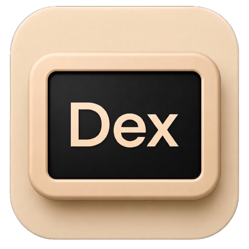

# AirMate

Your tablet, doing something useful.

AirMate turns an Android tablet into a second display for your computer. On a
Mac that is a real monitor macOS can see and arrange, not a mirror of a window.
On Windows it is whichever display you point it at — including one you added
yourself.

Built for the Galaxy Tab A7 and anything like it.

## What it does

- **A real display** — the Mac creates an actual virtual monitor and only
  captures that one, so your own screen is never recorded and never sent.
- **Or a display you already have** — on Windows, pick which one to send.
- **Finds itself** — put both on the same Wi‑Fi and they pair on their own.
  There is a QR code on the Mac if you want to skip the search.
- **Gets out of the way** — the moment the picture arrives the interface parts
  down the middle and is taken off the device entirely. What is left is a
  decoder and a surface.
- **Read with your hands** — tap to click, drag to scroll. The pointer is
  borrowed, not taken: it goes to where you touched, acts, and returns to
  wherever it was, so the tablet never drags the cursor off the screen you are
  working on.
- **Comes back with the back gesture** — back opens the host's own controls
  rather than leaving, the way a game pauses: start and stop, resolution, how the
  tablet may rotate, and how hard to try before dropping a frame.
- **Sized for your screen** — the resolutions on offer are worked out from the
  tablet's own panel, at its own shape, so the picture fills it instead of sitting
  in bars. Sizes its decoder cannot handle are not offered, because those are not a
  worse picture but no picture at all.
- **Turns the way you want** — auto-rotates within one axis at a time, so it
  never half-turns into the other shape while you are reading. Changing axis
  turns the Mac's display too; the stripes close over the picture while it is
  rebuilt and open again on the new shape.
- **Starts with your computer**, if you want it to — on macOS and on Windows.

Hardware encode on the Mac, hardware decode on the tablet, and nothing in
between that waits: the picture on screen is always the newest one that arrived.

## Windows brings its own display

There is no way for a Windows program to create a virtual monitor. macOS has a
private API for it; Windows has none at all — a new display there means an
**indirect display driver**, which is a signed kernel-adjacent driver package,
and AirMate does not ship one.

So the Windows app mirrors a display that already exists. If you only have real
monitors, that is what you get: a copy of one of them, useful for a second view
but not a second desktop.

**To get a true second display on Windows, install a virtual display driver
yourself.** Any of the community indirect display drivers will do. Once it is
installed, Windows treats its display like any other, it appears in AirMate's
picker alongside your real ones, and sending it gives you exactly what the Mac
gives you — a desktop Windows can arrange, on the tablet. AirMate needs no
special support for this and does not care which driver you chose.

The picker only appears when there is more than one display to choose from.

## Setting the host's controls from the tablet

Pairing is the authorisation. The tablet being sent the picture is the tablet
whose commands are obeyed, and anything from another address is discarded. There
is no second confirmation step, because a device already receiving your screen
gains nothing by also being asked whether it may change it — see
`docs/SECURITY.md` for what that does and does not protect.

Resolution applies on macOS, which owns the display it created. Windows is
mirroring a display it did not create, so it ignores that and says so rather than
pretending. Tapping and scrolling work on both.

Tapping and scrolling need Accessibility on macOS, which is a separate grant from
Screen Recording. macOS refuses synthesised clicks silently, so the window asks
for it and says plainly that touch does nothing without it.

## Building

Everything is built by GitHub Actions — the macOS app, the Windows app and the
Android APK, with the APK bundled inside the `.app` so the Mac can hand it to
you. Push and take the artifacts from the run, or start the workflow by hand.

```
gh run download <run-id> -R RimorCosmicam/AirMate -n airmate-android-debug
```

On macOS, unzip the archive, move `AirMate.app` into Applications, then
Control-click it and choose **Open** the first time. Approve Screen Recording
when macOS asks, and restart AirMate so the grant takes effect. The build is
ad-hoc signed, not notarized.

## Before you use it

> [!WARNING]
> `CGVirtualDisplay` is a private CoreGraphics API. It is isolated in
> `mac/Sources/AirMatePrivateCG` so it can be replaced without touching capture,
> encoding, transport or UI — but a build using it cannot go to the Mac App
> Store.

> [!WARNING]
> Nothing on the wire is encrypted or authenticated yet. Anyone on the same
> network can receive the video. Use this on a network you trust, and read
> `docs/SECURITY.md` before you use it anywhere else.

## Under the hood

- `mac/` — Swift menu-bar host, virtual display, ScreenCaptureKit, VideoToolbox,
  UDP sender; SwiftUI window
- `windows/` — C# tray host, DXGI Desktop Duplication, Media Foundation, the same
  UDP sender and the same reading mode; WinForms window
- `android/` — Kotlin client, UDP reassembly, `MediaCodec`, `SurfaceView`;
  Compose overlay
- `protocol/` — the wire format, video and control
- `docs/` — architecture, security boundaries, test plan

All three clients are drawn in Mont: black at 92%, square corners, and one
typeface doing the work that borders and shadows used to.

> Mont is a commercial typeface from Fontfabric and is bundled in all three clients.
> Check the licence covers redistribution before publishing a release built from
> this tree.



## The phone can send it, too

There is an experimental Android host as well. A Galaxy phone builds itself a
display, One UI puts Samsung DeX on it of its own accord, and that desktop goes
to AirMate on the tablet — a second screen for a phone, hosted by the phone.

It wants wireless debugging turned on once. Only the shell user may create the
kind of display DeX will attach to, and pairing on the device is how the app
becomes one. No root, and nothing installed on a computer.

`androidhost/` — Kotlin app with an ADB client of its own, and a shell-side host
that makes the display, encodes it, and speaks the same wire format the Mac does.
